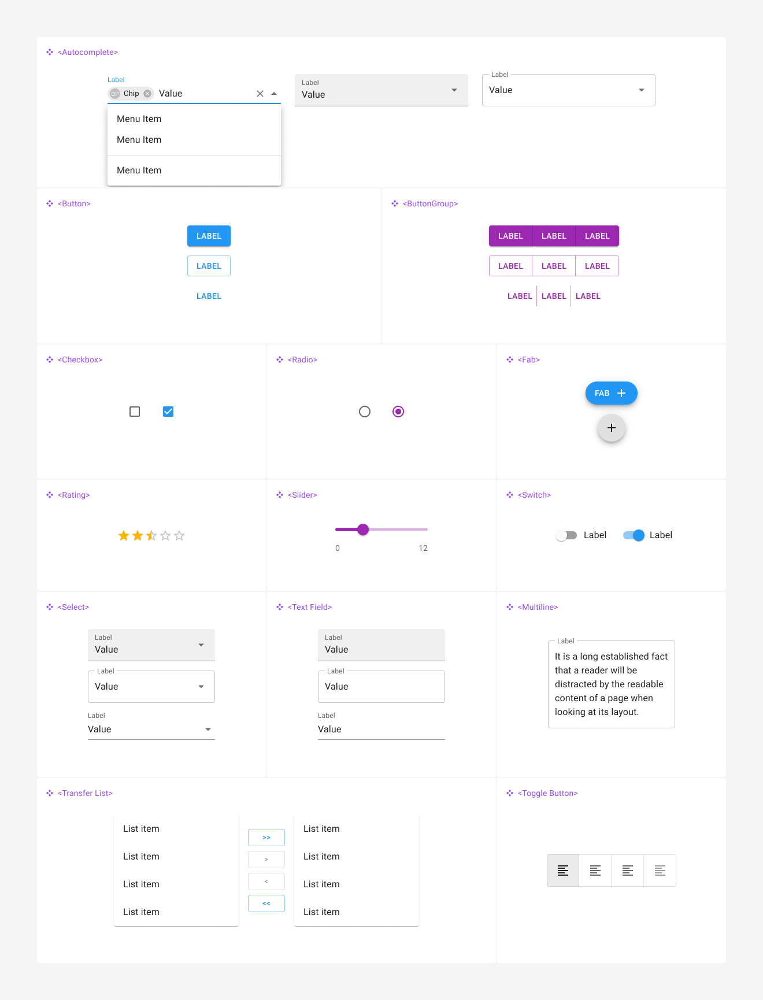

# Material UI

Se você está em busca de criar interfaces de usuário modernas, elegantes e funcionais, a biblioteca Material UI é a escolha certa. Baseada no design system do Google, Material UI oferece uma ampla gama de componentes prontos para uso, todos seguindo as diretrizes do Material Design. Essa biblioteca é uma das mais populares para desenvolvedores que utilizam React, pois facilita a criação de interfaces responsivas e acessíveis sem sacrificar a estética.

<figure><figcaption>
Relacionamento entre Material Design e Material UI
</figcaption></figure>

Empresas líderes em tecnologia e inovação utilizam Material UI em seus projetos, o que comprova a robustez e a versatilidade dessa biblioteca. Gigantes como **Spotify** e **Netflix** aproveitam os componentes do Material UI para criar interfaces intuitivas e envolventes, garantindo uma experiência de usuário de alta qualidade. Além disso, **Airbnb** e **NASA** confiam na biblioteca para desenvolver soluções que precisam ser tanto visualmente atraentes quanto funcionalmente eficientes.

## Tipos de Componentes do Material UI

Material UI oferece uma extensa variedade de componentes que ajudam a construir aplicações web completas e consistentes. Aqui estão algumas das principais categorias de componentes disponíveis.

### **Inputs**

&#x20;Campos de texto, checkboxes, radio buttons, selects, sliders e outros elementos para coleta de dados dos usuários.

<figure><figcaption>
Visão Geral dos Componentes de Entrada de Dados (Inputs)
</figcaption></figure>

### **Data Display**

Tabelas, listas, avatares, badges, tooltips e outros componentes para exibir informações de maneira clara e acessível.

### **Feedback**

Diálogos, snackbars, progress indicators e outros componentes para fornecer feedback ao usuário.

### **Surface**

Cards, accordions, paper e outros elementos para criar seções distintas e destacar conteúdo.

### **Navigation**

Menus, abas, breadcrumbs, toolbars e outros componentes para facilitar a navegação do usuário.

### **Layout**

Grid system, boxes, containers e outros elementos para estruturar a página de forma responsiva e organizada.

### **Utils**

Componentes utilitários que ajudam na construção e manutenção de interfaces, como popovers, transitions e cssBaseline.

***

Esses componentes serão vistos detalhadamente nos estudos de caso.

## Produtos da MUI

Além dos componentes, a MUI oferece três principais produtos para atender diferentes necessidades de desenvolvimento.

### **MUI Core**

É a biblioteca principal. É gratuita e inclui todos os componentes básicos do Material UI. É ideal para a maioria dos projetos que precisam de uma interface de usuário moderna e consistente.

### **MUI X**

Esta é uma extensão do MUI Core, oferecendo componentes avançados e complexos, como data grids, date pickers e outros elementos que demandam mais funcionalidade e customização. É voltado para aplicações mais sofisticadas que necessitam de recursos adicionais. Não é gratuita.

### **MUI for Figma**

Este produto é destinado a designers que utilizam o Figma. Ele fornece uma biblioteca completa de componentes Material UI que podem ser utilizados diretamente no Figma para criar protótipos e designs de alta fidelidade, garantindo que o design e o desenvolvimento estejam perfeitamente alinhados. Não é gratuita.

## Para saber mais

* [MUI](https://mui.com/)
* [Material Design](https://m3.material.io/)
