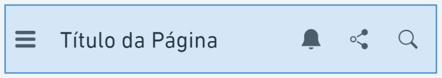

# Wireframe

### Comece pelo conteúdo

ALTERAÇÃO FEITA NO GITBOOK.

No início de um projeto de design, é tentador ir direto para a interface visual que você imaginou. A maioria das pessoas pensa no design de interface como desenhar caixas dentro de outras caixas, começando pela janela do aplicativo ou navegador e dividindo em seções menores. No entanto, se você desenhar essas caixas de forma arbitrária, elas não se ajustarão ao conteúdo.

É mais eficaz deixar que a forma e a estrutura surjam em relação ao conteúdo. Dê ao conteúdo a forma que ele deseja, em vez de forçá-lo a caber em uma estrutura inadequada. Quando os usuários visitam sites, eles buscam informações como preços, horários de funcionamento ou quem gostou de uma postagem recente. Certifique-se de que o conteúdo que você cria é o que seus usuários procuram. Então, decida como apresentá-lo de maneira que ajude os usuários a atingir seus objetivos.

### Separe o conteúdo do layout

Embora não seja o momento de focar na apresentação e layout, não é cedo demais para pensar na informação que você quer fornecer e sua prioridade na interface. Este é um dos primeiros passos no processo chamado modelagem de conteúdo.

Um modelo de conteúdo usa blocos para organizar os elementos essenciais, prioridades e a ordem da página. Isso ajuda a definir o que precisa ser dito e em que ordem, não o texto final, mas os conceitos e propósitos de cada seção.

Você pode fazer isso em um documento de texto ou usar notas adesivas. Comece listando todo o conteúdo que você acha que deve aparecer em uma tela específica. Em seguida, tente organizar as notas adesivas em ordem de importância, de cima para baixo. Isso ajudará a garantir que seus usuários vejam primeiro o conteúdo de maior prioridade. Visualizar essas informações em blocos ajuda a imaginar como elas podem fluir em uma página e o espaço que podem ocupar. Se for muito para uma página, pense no que pode ser removido ou movido para outra página.

<figure><figcaption>
Modelo de conteúdo para o estudo de caso 1.
</figcaption></figure>

### Projete de dentro para fora

Ao projetar interfaces, é comum começar desenhando a tela inteira e preenchendo-a com elementos, mas isso pode levar a problemas de layout e desviar o foco do conteúdo. A técnica de design de dentro para fora propõe começar com os menores detalhes de conteúdo e expandir para fora. Isso ajuda a criar uma estrutura que se ajusta ao conteúdo, em vez de forçá-lo a caber em um layout predefinido. Essa abordagem mantém o foco no que realmente importa: o conteúdo e sua apresentação eficaz.

<figure><figcaption>
Dados do formulário.
</figcaption></figure>

### Foque nas interações críticas

Para criar wireframes eficazes, comece pelas interações mais críticas do seu produto, como um pedido de compra ou o registro de um novo funcionário. Concentre-se em acertar essas interações principais desde o início, ignorando inicialmente o fluxo completo do usuário. Essa abordagem ajuda a priorizar os elementos mais importantes e garante que as etapas essenciais recebam a atenção necessária. Focar nesses pontos críticos pode melhorar significativamente a experiência do usuário e o sucesso do produto.

<figure><figcaption></figcaption></figure>

<figure><figcaption></figcaption></figure>

### Crie uma segunda versão

### Crie sua interface em torno do conteúdo

### Para saber mais

[How to Use Wireframes for Content Modeling](https://balsamiq.com/learn/articles/wireframes-content-modeling/)

