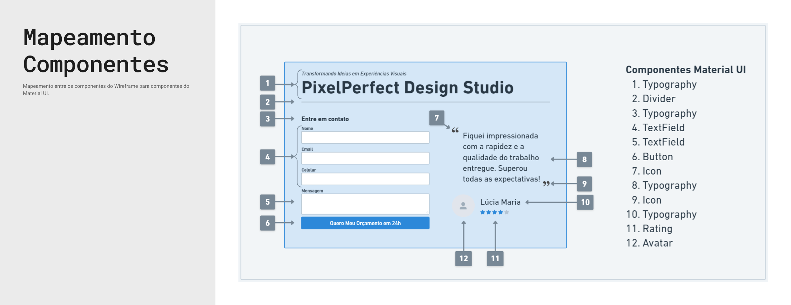

# Estudo de Caso 1: Desenvolvimento de um Formulário de Contato

Neste primeiro estudo de caso, vamos desenvolver um formulário de contato básico. O objetivo é proporcionar uma introdução prática aos componentes do Material UI, utilizando uma interface simples e funcional. Este estudo de caso é ideal para iniciantes que desejam aprender os conceitos fundamentais do Material UI e aplicá-los em um projeto real.

## **Contexto de Negócio**

Imagine que você foi contratado por uma pequena empresa de design gráfico que precisa de um formulário de contato em seu site para facilitar a comunicação com clientes potenciais. A empresa quer um formulário que seja esteticamente agradável e fácil de usar, garantindo que os visitantes possam enviar suas mensagens de maneira rápida e intuitiva.

A empresa deseja que o formulário contenha os seguintes campos:

* Nome
* E-mail
* Telefone
* Mensagem

Além disso, o formulário deve incluir validações básicas para garantir que os dados inseridos pelos usuários sejam válidos. Por exemplo, o campo de e-mail deve ser verificado para garantir que o endereço inserido seja válido, e todos os campos devem ser obrigatórios.

## Iniciando pelo Conteúdo

> _O conteúdo precede o design. Design sem conteúdo não é design, é decoração."_
>
> [L. Jeffrey Zeldman](https://zeldman.com/2008/05/06/content-precedes-design/).

No início de um projeto de design, é tentador ir direto para a interface visual que você imaginou. A maioria das pessoas pensa no design de interface como desenhar caixas dentro de outras caixas, começando pela janela do aplicativo ou navegador e dividindo em seções menores. No entanto, se você desenhar essas caixas de forma arbitrária, elas não se ajustarão ao conteúdo.

É mais eficaz deixar que a forma e a estrutura surjam em relação ao conteúdo. Dê ao conteúdo a forma que ele deseja, em vez de forçá-lo a caber em uma estrutura inadequada. Quando os usuários visitam sites, eles buscam informações como preços, horários de funcionamento ou quem gostou de uma postagem recente. Certifique-se de que o conteúdo que você cria é o que seus usuários procuram. Então, decida como apresentá-lo de maneira que ajude os usuários a atingir seus objetivos.

## Primeira Versão do Modelo de Conteúdo

Embora não seja o momento de focar na apresentação e layout, não é cedo demais para pensar na informação que você quer fornecer e sua prioridade na interface. Este é um dos primeiros passos no processo chamado modelagem de conteúdo.

Um modelo de conteúdo usa blocos para organizar os elementos essenciais, prioridades e a ordem da página. Isso ajuda a definir o que precisa ser dito e em que ordem, não o texto final, mas os conceitos e propósitos de cada seção.

Você pode fazer isso em um documento de texto ou usar notas adesivas. Comece listando todo o conteúdo que você acha que deve aparecer em uma tela específica. Em seguida, tente organizar as notas adesivas em ordem de importância, de cima para baixo. Isso ajudará a garantir que seus usuários vejam primeiro o conteúdo de maior prioridade. Visualizar essas informações em blocos ajuda a imaginar como elas podem fluir em uma página e o espaço que podem ocupar. Se for muito para uma página, pense no que pode ser removido ou movido para outra página.

<figure><figcaption>
Modelo de conteúdo V1.
</figcaption></figure>

## Segunda Versão do Modelo de Conteúdo

Transforme suas notas em esboços de wireframes. Organize as informações relevantes em uma tabela. Avance sem se prender a detalhes e busque feedback o quanto antes, atualizando o modelo de conteúdo conforme necessário. Separar o conteúdo do design visual (layout, cores, tipografia, imagens) facilita o consenso em reuniões com usuários/clientes.

Quando o conteúdo estiver validado, o trabalho pode prosseguir com menos atrito e retrabalho. Gosto de pensar no modelo de conteúdo como uma tela desorganizada que contém todos os ingredientes necessários para se criar uma boa interface.

<figure><figcaption>
Modelo de conteúdo V2.
</figcaption></figure>

## Projetando a interface ao Redor do Conteúdo

Com base no conteúdo, desenvolva várias versões de wireframes, desde as mais simples e diretas até as mais elaboradas, e solicite feedback dos seus usuários/clientes.&#x20;

<figure><figcaption>
Wireframe V1
</figcaption></figure>

Eu costumo criar entre 3 a 10 versões para uma única tela. Depois, seleciono as melhores e apresento de 2 a 5 opções para o usuário.

<figure><figcaption>
Wireframe V2
</figcaption></figure>

Combinando os blocos de conteúdo é possível criar diversos wireframes.

<figure><figcaption>
Wireframe V3
</figcaption></figure>

## Incorpore Acessibilidade no Design


Os conceitos básicos de acessibilidade para designers são apresentados no artigo: [Como Trabalhar Acessibilidade no Design](../comece-rapidamente/como-trabalhar-acessibilidade-no-design.md).


A acessibilidade começa no design. Podemos aproveitar o momento em que estamos criando os wireframes para já incorporar práticas de acessibilidade, garantindo que todos os usuários tenham uma experiência inclusiva e eficiente.

### Landmarks e Cabeçalhos

<figure><figcaption>
Anotações de acessibilidade no wireframe
</figcaption></figure>

### Ordens de Foco (F), Leitura (L) e Texto Alternativo (alt)

<figure><figcaption>
Anotações de acessibilidade no wireframe
</figcaption></figure>

## De Wireframes no Whimsical a Protótipos no Figma


Uma apresentação do UI Kit do Figma para Material UI pode ser vista no artigo: [Material UI for Figma.](broken-reference)


Vamos usar a última versão do wireframe (V3) como base para começar o desenvolvimento do protótipo no Figma. Como passo inicial, mapeamos cada componente do wireframe para os componentes do Material UI.

<figure><figcaption>
Mapeamento de Componentes do Wireframe para Componentes do Material UI
</figcaption></figure>

## Componentes do Material UI Utilizados

### Typography

#### Estilos utilizados: h1 e overline

**Casos de Uso:**

* **Rótulos de seções:** Utilizado para rotular ou separar seções dentro de um documento ou aplicação.
* **Descrições curtas:** Ideal para pequenos textos explicativos ou informações suplementares.
* **Indicadores de estado:** Usado para mostrar o estado atual de um item ou processo, como "ativo" ou "completo".

### Divider

### TextField

O componente TextField no MUI é uma entrada de texto combinada com rótulo, ajudando na coleta de dados dos usuários em formulários.

<figure><figcaption>
Variações do componente Text Field. Imagem obtida no <a href="https://www.figma.com/community/file/912837788133317724">Material UI for Figma Community Edition</a>.
</figcaption></figure>

### Button

### Icon

### Rating

### Avatar

## Para saber mais

* [How to Use Wireframes for Content Modeling](https://balsamiq.com/learn/articles/wireframes-content-modeling/)
